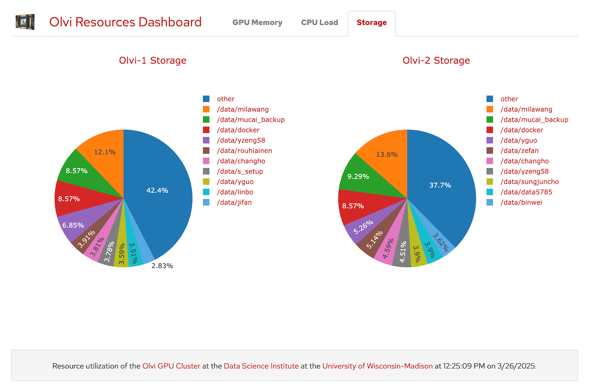

<p align="center">
  <div align="center">
    
  </div>
</p>

# GPU Dashboard

The GPU Dashboard is an application for displaying resource utilization information about a GPU enabled server.


# Capabilities

The GPU Dashboard enables you to view the following information:
- GPU Memory
    - What GPUs are in use
    - What users are using the GPUs
    - How much memory is each GPU process consuming
- GPU Storage
    - View CPU load by GPU process
- Storage
    - View disk storage by directory name
    - How much storage are each of the largest directories consuming.
    

CPU Load


Storage

## Architecture

This application is composed of three main parts:

### 1. Logger
The logger runs on the GPU server and contains a set of scripts that run periodically using a cron job to post GPU and storage data to the server.

### 2. Server
The server component listens for incoming requests to either post new logging information from the GPU or to provide data to the client.

### 3. Client
The client is the dashboard front end which requests data from the server and displays the data in an easy to user visual form.

## Installation

### 1. GPU Server
Upload the logger files to the GPU server and add a cron job to periodically run the following scripts to report data to the web server:

```
python3 report-gpus.py
python3 report-storage.py
```

### 2. Web Server
This web application is Dockerized so you should be able to run it by simply uploading this project to your web server and running:

```
docker compose up
```

## License

Distributed under the MIT License. See `LICENSE` for more information.

## Contact

Abe Megahed - (mailto:amegahed@wisc.edu) - email
